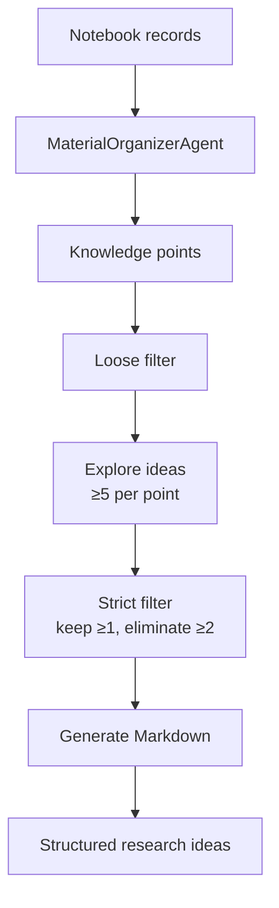

Idea generation turns the records you have collected in a notebook into structured research proposals. The **Automated IdeaGen** pipeline extracts knowledge points from those records, explores candidate ideas, applies two rounds of filtering, and outputs an organized Markdown document.

For interactive, editor-based idea development, see [Co-writer](/features/co-writer), which provides a freeform writing environment with AI editing and RAG-enhanced context.

<CardGroup cols={2}>
  <Card title="Notebook-driven input" icon="book-open">
    Works directly from your saved notebook records — no manual data entry needed.
  </Card>
  <Card title="Multi-stage filtering" icon="filter">
    Loose filter removes weak candidates; strict filter ensures quality before output.
  </Card>
  <Card title="Broad exploration" icon="lightbulb">
    Generates at least 5 ideas per knowledge point from multiple research dimensions.
  </Card>
  <Card title="Structured output" icon="file-text">
    Produces a Markdown document organized by knowledge point with ranked ideas.
  </Card>
</CardGroup>

## How to use

<Steps>
  <Step title="Open the idea generation page">
    Navigate to `http://localhost:3782/ideagen`.
  </Step>
  <Step title="Select a notebook">
    Choose a notebook that contains records from previous sessions (solver outputs, research reports, question generation results, or co-writer documents).
  </Step>
  <Step title="Optionally add your thoughts">
    Enter any research directions, constraints, or focus areas you want the agent to prioritize.
  </Step>
  <Step title="Generate ideas">
    Click **Generate Ideas**. Progress updates stream in real time as each stage completes.
  </Step>
  <Step title="Review the output">
    The final Markdown document lists each knowledge point with its curated set of research ideas.
  </Step>
</Steps>

## Automated IdeaGen pipeline

The pipeline has two components: a **MaterialOrganizerAgent** that extracts knowledge points from your notebook, and an **IdeaGenerationWorkflow** that turns those points into filtered research ideas.



### MaterialOrganizerAgent

Reads the raw records from your selected notebook — which may include solve outputs, generated questions, research cache entries, and co-writer documents — and extracts a list of core knowledge points. Each knowledge point includes a name and a description derived from the record content.

```python
[
    {
        "knowledge_point": "Attention mechanism",
        "description": "Mechanism that assigns dynamic weights to input tokens..."
    },
    ...
]
```

Optional `user_thoughts` are passed into the extraction prompt to bias which knowledge points are surfaced.

### IdeaGenerationWorkflow stages

**Stage 1 — Loose filter**

Removes knowledge points that are obviously unsuitable for research idea generation (too narrow, too broad, already exhaustively studied, etc.). The remaining points proceed to exploration.

**Stage 2 — Explore ideas**

For each knowledge point that passes the loose filter, the agent generates at least 5 candidate research ideas. Ideas are produced from multiple innovation dimensions to maximize diversity.

**Stage 3 — Strict filter**

Each knowledge point's idea list is evaluated strictly. The filter must keep at least 1 idea and eliminate at least 2. This ensures only the most promising, clearly differentiated ideas survive.

**Stage 4 — Generate Markdown**

The surviving ideas are assembled into a structured Markdown document grouped by knowledge point.

## Output format

```markdown
# Research Ideas

## Attention mechanism
Description: Mechanism that assigns dynamic weights to input tokens...

### Research Ideas
1. Sparse attention patterns for long-document summarization
2. Learned positional attention biases for code generation

## Knowledge point 2
...
```

## Python API

You can run idea generation programmatically without the web interface.

```python
import asyncio
from src.agents.ideagen import IdeaGenerationWorkflow, MaterialOrganizerAgent
from src.core.core import get_llm_config

async def main():
    llm_config = get_llm_config()

    # Step 1: extract knowledge points from notebook records
    organizer = MaterialOrganizerAgent(
        api_key=llm_config["api_key"],
        base_url=llm_config["base_url"]
    )
    records = [...]  # list of notebook record dicts
    knowledge_points = await organizer.process(
        records,
        user_thoughts="Focus on efficiency improvements"
    )

    # Step 2: run the filtering and generation workflow
    workflow = IdeaGenerationWorkflow(
        api_key=llm_config["api_key"],
        base_url=llm_config["base_url"],
        progress_callback=print  # optional streaming updates
    )

    filtered_points = await workflow.loose_filter(knowledge_points)

    ideas_map = {}
    for point in filtered_points:
        ideas = await workflow.explore_ideas(point)
        filtered_ideas = await workflow.strict_filter(point, ideas)
        ideas_map[point["knowledge_point"]] = filtered_ideas

    markdown = await workflow.generate_markdown(filtered_points, ideas_map)
    print(markdown)

asyncio.run(main())
```

### API endpoint

The module is also accessible via the REST API:

```bash
POST /api/v1/ideagen/generate
```

```json
{
  "notebook_id": "notebook_123",
  "user_thoughts": "Focus on efficiency improvements"
}
```

Response:

```json
{
  "success": true,
  "markdown": "# Research Ideas\n\n## ...",
  "knowledge_points": [...],
  "ideas_map": { "Attention mechanism": ["Idea 1", "Idea 2"] }
}
```

## Relationship to co-writer

Automated IdeaGen produces a structured starting document. You can open that document in the [Co-writer](/features/co-writer) to expand individual ideas, rewrite sections with RAG-enhanced context, or generate a narrated audio version for review.

<Note>
  Idea generation requires at least one notebook with saved records. If your notebook is empty, complete some sessions in the solver, question generator, or deep research modules first and save results to a notebook.
</Note>
